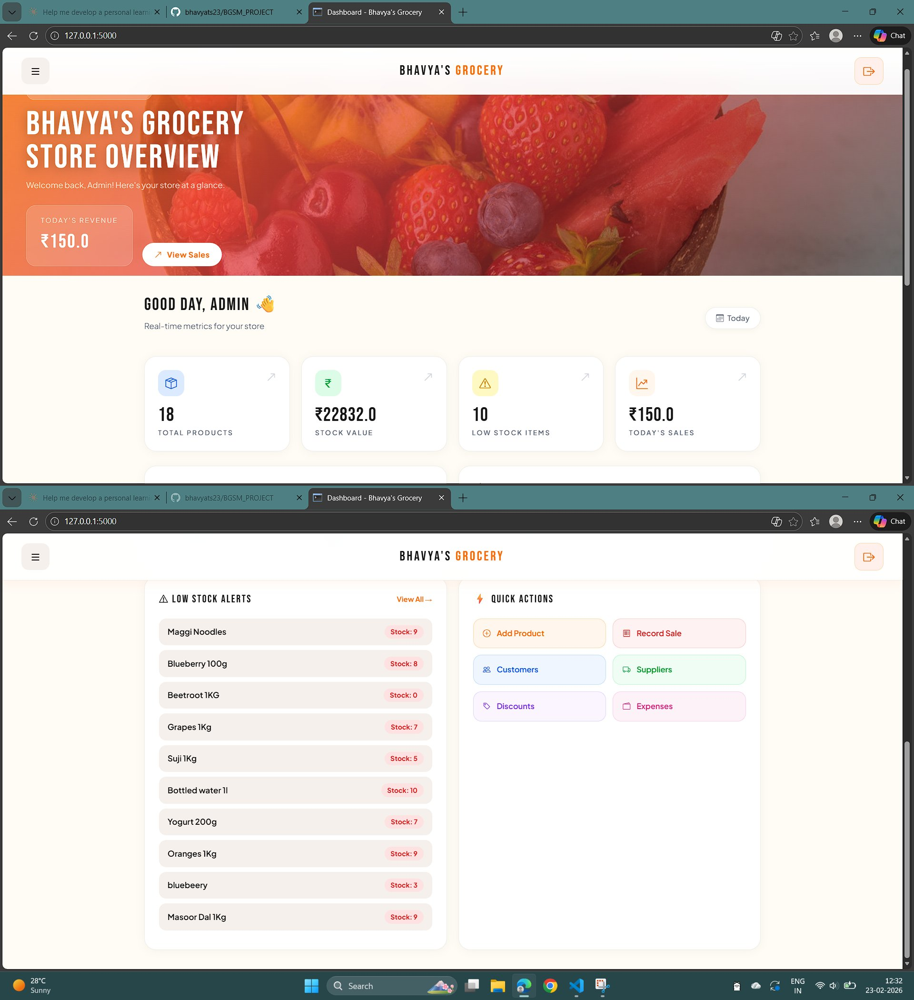
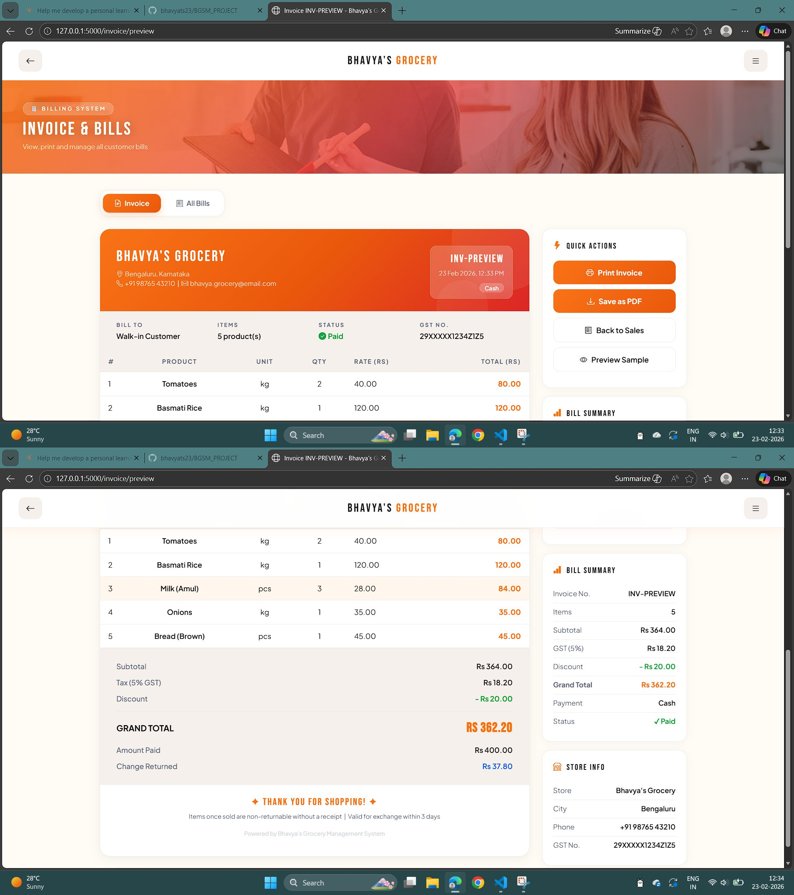

# 🛒 Bhavya's Grocery Management System

> A full-stack web application to digitize and streamline day-to-day operations of a small grocery store — built with Python Flask & Supabase.


---

## 📌 Table of Contents

- [About the Project](#about-the-project)
- [Features](#features)
- [Tech Stack](#tech-stack)
- [Project Structure](#project-structure)
- [Database Tables](#database-tables)
- [Getting Started](#getting-started)
- [How to Run](#how-to-run)
- [Screenshots](#screenshots)
- [Challenges Faced](#challenges-faced)
- [Future Improvements](#future-improvements)
- [Author](#author)

---

## 📖 About the Project

Bhavya's Grocery Management System is a web-based application designed to replace manual bookkeeping for small grocery stores. It provides a clean, modern dashboard to manage products, sales, inventory, customers, suppliers, expenses and generate professional invoices — all from one platform.

**Problem it solves:**
- No more manual paper bills
- Real-time stock tracking
- Instant GST-calculated invoices
- Centralized data for sales, expenses and customers

---

## ✨ Features

| Module | Description |
|--------|-------------|
| 📊 Dashboard | Live stats — revenue, sales count, low stock alerts |
| 🧾 Sales & Billing | Record sales, auto-calculate totals |
| 📦 Inventory | Track stock levels, get low-stock alerts |
| ➕ Add Products | Add/edit products with price, unit & category |
| 👥 Customers | Maintain customer records and history |
| 🚚 Suppliers | Manage supplier contacts and product links |
| 🏷️ Discounts | Create and apply discount codes |
| 🛒 Purchase Orders | Track restocking orders from suppliers |
| ↩️ Returns | Handle product returns and adjustments |
| 💰 Expenses | Log and categorize store expenses |
| 📄 Invoice System | Auto-generated bills with GST, print & PDF support |

---

## 🛠️ Tech Stack

| Layer | Technology |
|-------|-----------|
| Backend | Python 3.11, Flask |
| Database | Supabase (PostgreSQL) |
| Frontend | HTML5, Bootstrap 5.3, Jinja2 |
| Auth | Flask-Login |
| Env Config | python-dotenv |
| Launcher | Windows .bat file |

---

## 📁 Project Structure

```
bhavyas-grocery/
├── app.py                  # Main Flask application
├── requirements.txt        # Python dependencies
├── .env                    # Environment variables (not pushed to GitHub)
├── .gitignore              # Git ignore rules
├── start_app.bat           # Windows one-click launcher
├── static/
│   └── (CSS, JS, images)
└── templates/
    ├── base.html
    ├── login.html
    ├── dashboard.html
    ├── sales.html
    ├── invoice.html
    ├── inventory.html
    ├── add_product.html
    ├── customers.html
    ├── suppliers.html
    ├── discounts.html
    ├── purchase_orders.html
    ├── returns.html
    └── expenses.html
```

---

## 🗄️ Database Tables

The project uses **Supabase (PostgreSQL)** with 8 tables:

| Table | Key Columns |
|-------|-------------|
| `users` | id, email, password, role |
| `products` | id, name, price, stock, unit, category |
| `sales` | id, product_id, quantity, total_price, created_at |
| `customers` | id, name, phone, email, address |
| `suppliers` | id, name, contact, product_id |
| `expenses` | id, description, amount, category, created_at |
| `purchase_orders` | id, supplier_id, product_id, quantity |
| `discounts` | id, product_id, discount_pct, valid_to |

---

## 🚀 Getting Started

### Prerequisites

- Python 3.10 or above
- pip
- A free [Supabase](https://supabase.com) account

### 1. Clone the Repository

```bash
git clone https://github.com/YOUR_USERNAME/bhavyas-grocery.git
cd bhavyas-grocery
```

### 2. Install Dependencies

```bash
pip install -r requirements.txt
```

### 3. Setup Environment Variables

Create a `.env` file in the root folder:

```env
SUPABASE_URL=your_supabase_project_url
SUPABASE_KEY=your_supabase_anon_key
SECRET_KEY=your_flask_secret_key
```

> ⚠️ Never push your `.env` file to GitHub. It's already in `.gitignore`.

### 4. Setup Supabase Tables

Go to your Supabase project → SQL Editor and create the 8 tables listed above.

---

## ▶️ How to Run

### Option 1 — Windows One-Click (Recommended)

Just double-click `start_app.bat` — it auto-installs dependencies and opens the browser!

### Option 2 — Terminal

```bash
python app.py
```

Then open your browser and go to:
```
http://localhost:5000
```

---

## 📸 Screenshots

> *(Add screenshots of your app here by dragging images into the GitHub README editor)*

| Dashboard | Sales Page | Invoice |
|-----------|-----------|---------|
|  |  |  |

---

## ⚠️ Challenges Faced

1. **Empty Product Dropdown** — The sales page dropdown was not loading products. Fixed by updating the Flask route to correctly pass the `products` list to the Jinja2 template.

2. **Consistent UI Design** — Maintaining the same Sunrise theme (orange accents, Bebas Neue font, hero banners) across all 11 pages required careful planning and reusable CSS.

3. **Invoice Auto-Generation** — Calculating GST, discounts, change returned and formatting it into a professional print-ready bill took multiple iterations to get right.

4. **Supabase Integration** — Handling errors when Supabase returns null data and ensuring all routes gracefully fall back without crashing the app.

---

## 🔮 Future Improvements

- [ ] Barcode scanner integration for faster billing
- [ ] SMS/WhatsApp invoice sending to customers
- [ ] Mobile app version (React Native)
- [ ] Monthly profit/loss report with charts
- [ ] Multi-user roles (cashier vs admin)
- [ ] Low stock auto-reorder notifications

---

## 👩‍💻 Author

**Bhavya**
📍 Bengaluru, Karnataka, India
🗓️ Built in 2026

> *"This project was built as a complete full-stack solution to solve real-world grocery store management problems."*

---

⭐ If you found this project helpful, please give it a star on GitHub!
