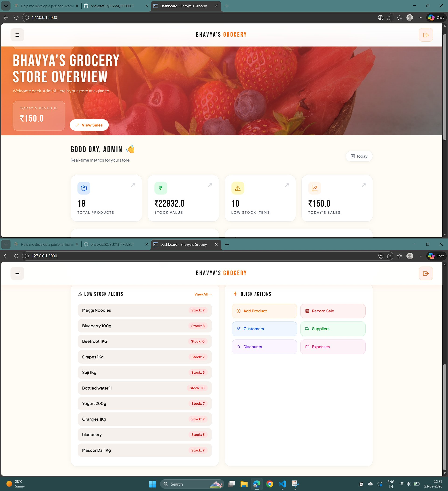
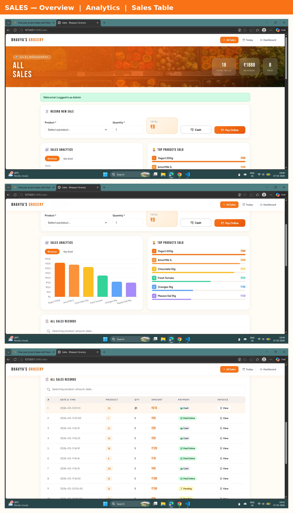
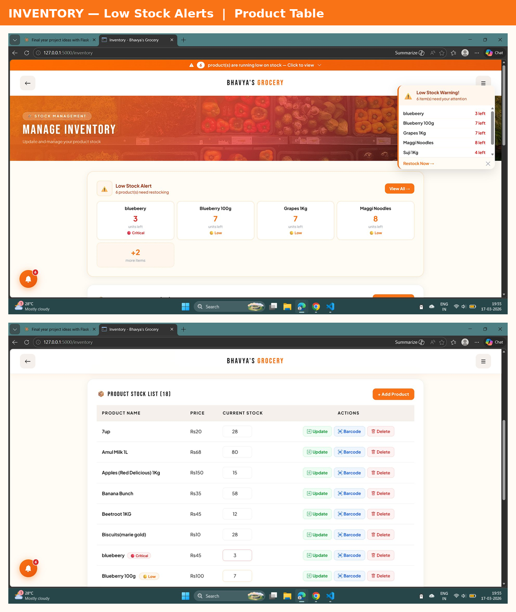
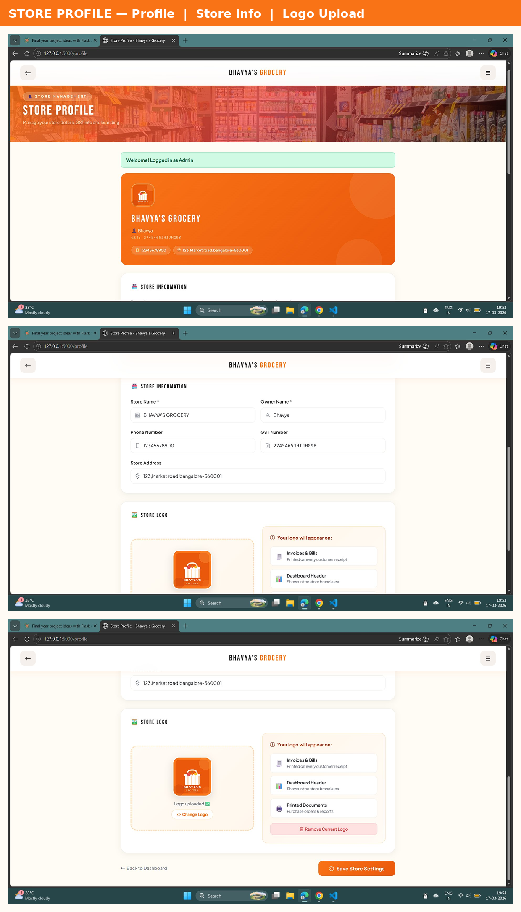
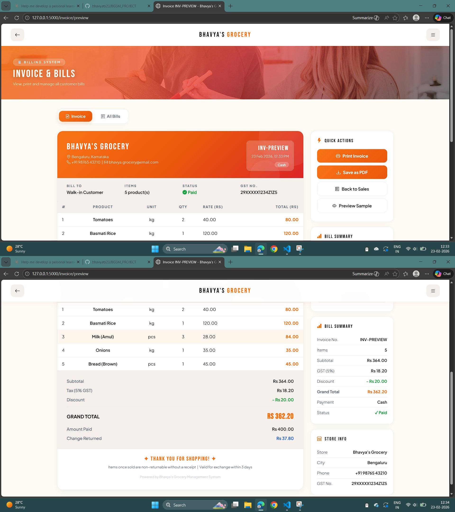

# 🛒 Bhavya's Grocery Management System

> A full-stack web application to digitize and streamline day-to-day operations of a small grocery store — built with Python Flask & Supabase.


---

## 📌 Table of Contents

- [About the Project](#about-the-project)
- [Features](#features)
- [Tech Stack](#tech-stack)
- [Project Structure](#project-structure)
- [Database Tables](#database-tables)
- [Getting Started](#getting-started)
- [Screenshots](#screenshots)
- [Login Roles](#login-roles)
- [Author](#author)

---

## 📖 About the Project

Bhavya's Grocery Management System is a web-based application designed to replace manual bookkeeping for small grocery stores. It provides a clean, modern dashboard to manage products, sales, inventory, customers, suppliers, expenses and generate professional invoices — all from one platform.

**Problem it solves:**

- No more manual paper bills
- Real-time stock tracking
- Instant GST-calculated invoices
- Centralized data for sales, expenses and customers
- Multi-staff access with role-based permissions

---

## ✨ Features

| Module               | Description                                                   |
| -------------------- | ------------------------------------------------------------- |
| 📊 Dashboard         | Live stats — revenue, sales count, low stock alerts           |
| 🧾 Sales & Billing   | Record sales with Cash or Online payment gateway              |
| 📦 Inventory         | Track stock levels, barcode generator, low-stock bell alerts  |
| ➕ Add Products      | Add/edit products with price, unit & category                 |
| 👥 Customers         | Maintain customer records and history                         |
| 🚚 Suppliers         | Manage supplier contacts and product links                    |
| 🏷️ Discounts         | Create and apply discount codes with expiry                   |
| 🛒 Purchase Orders   | Track restocking orders from suppliers                        |
| ↩️ Returns           | Handle product returns and stock adjustments                  |
| 💰 Expenses          | Log and categorize store expenses                             |
| 📄 Invoice System    | Auto-generated bills with GST, invoice number, payment status |
| 📊 Sales Analytics   | Bar charts — top products by revenue & quantity sold          |
| 👤 Store Profile     | Store name, GST, logo upload, owner details                   |
| 🔐 Multi-Staff Roles | Admin and Cashier role-based access control                   |
| 💳 Payment Gateway   | Simulated UPI, Card, NetBanking with processing animation     |

---

## 🛠️ Tech Stack

| Layer      | Technology                                   |
| ---------- | -------------------------------------------- |
| Backend    | Python 3.11, Flask, Flask-Login              |
| Database   | Supabase (PostgreSQL)                        |
| Frontend   | HTML5, CSS3, Bootstrap 5.3, Jinja2           |
| Auth       | Supabase Auth + Flask-Login                  |
| Charts     | Chart.js 4.4                                 |
| Barcodes   | JsBarcode 3.11                               |
| Fonts      | Google Fonts (Bebas Neue, Plus Jakarta Sans) |
| Env Config | python-dotenv                                |

---

## 📁 Project Structure

```
bhavyas-grocery/
├── app.py                  # Main Flask application
├── requirements.txt        # Python dependencies
├── .env                    # Environment variables (not pushed to GitHub)
├── .gitignore              # Git ignore rules
├── screenshots/            # README screenshots
└── templates/
    ├── login.html
    ├── dashboard.html
    ├── sales.html
    ├── invoice.html
    ├── inventory.html
    ├── add_product.html
    ├── customers.html
    ├── suppliers.html
    ├── discounts.html
    ├── purchase_orders.html
    ├── returns.html
    ├── expenses.html
    └── profile.html
```

---

## 🗄️ Database Tables

The project uses **Supabase (PostgreSQL)** with 10 tables:

| Table             | Key Columns                                                           |
| ----------------- | --------------------------------------------------------------------- |
| `users`           | id, email, role                                                       |
| `products`        | id, name, price, stock, unit, category                                |
| `sales`           | id, product_id, quantity, total_price, payment_method, payment_status |
| `customers`       | id, name, phone, email, address                                       |
| `suppliers`       | id, name, phone, email, product_type                                  |
| `expenses`        | id, title, amount, category, expense_date                             |
| `purchase_orders` | id, supplier_id, product_id, quantity, status                         |
| `discounts`       | id, code, discount_type, discount_value, expires_at, is_active        |
| `returns`         | id, sale_id, product_id, quantity, refund_amount, status              |
| `store_settings`  | id, store_name, owner_name, phone, address, gst_number, logo_url      |

---

## 🚀 Getting Started

### Prerequisites

- Python 3.10 or above
- pip
- A free [Supabase](https://supabase.com) account

### 1. Clone the Repository

```bash
git clone https://github.com/bhavyats23/BGSM_PROJECT.git
cd BGSM_PROJECT
```

### 2. Create Virtual Environment

```bash
python -m venv .venv
.venv\Scripts\activate        # Windows
source .venv/bin/activate     # Mac/Linux
```

### 3. Install Dependencies

```bash
pip install flask flask-login supabase python-dotenv
```

### 4. Create `.env` File

```
SUPABASE_URL=your_supabase_url_here
SUPABASE_KEY=your_supabase_anon_key_here
SECRET_KEY=any-random-secret-string
```

### 5. Run the App

```bash
python app.py
```

Open `http://127.0.0.1:5000` in your browser!

---

## 📸 Screenshots

### 🏠 Dashboard



### 🧾 Sales & Analytics



### 📦 Inventory



### 👤 Store Profile
 


### 📄 Invoice



---

## 🔑 Login Roles

| Role    | Access                                  |
| ------- | --------------------------------------- |
| Admin   | Full access to all 12 modules           |
| Cashier | Sales, Customers, Returns, Invoice only |

### 🔐 Role-Based Access Control

| Module          | Admin | Cashier |
| --------------- | ----- | ------- |
| Dashboard       | ✅    | ✅      |
| Sales & Billing | ✅    | ✅      |
| Invoice         | ✅    | ✅      |
| Customers       | ✅    | ✅      |
| Returns         | ✅    | ✅      |
| Inventory       | ✅    | ❌      |
| Add Product     | ✅    | ❌      |
| Suppliers       | ✅    | ❌      |
| Discounts       | ✅    | ❌      |
| Purchase Orders | ✅    | ❌      |
| Expenses        | ✅    | ❌      |
| Store Profile   | ✅    | ❌      |

### How to create a Cashier account:

1. Go to Supabase → Authentication → Users → Add User
2. Set Email: `cashier@bhavyas.com` and Password: `cashier123`
3. Run this SQL in Supabase SQL Editor:

```sql
INSERT INTO public.users (id, role)
VALUES (
  (SELECT id FROM auth.users WHERE email = 'cashier@bhavyas.com'),
  'cashier'
);
```

---

## 👩‍💻 Author

**Bhavya Pallavi**
Final Year Project — 2026
Built with ❤️ using Flask + Supabase

---

## 📄 License

This project is for educational purposes only.
